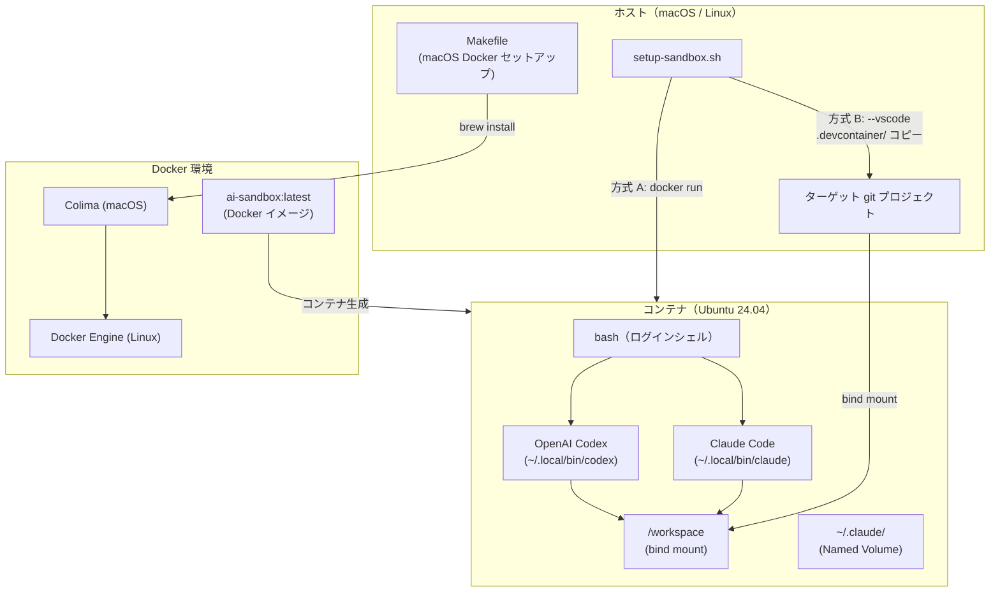
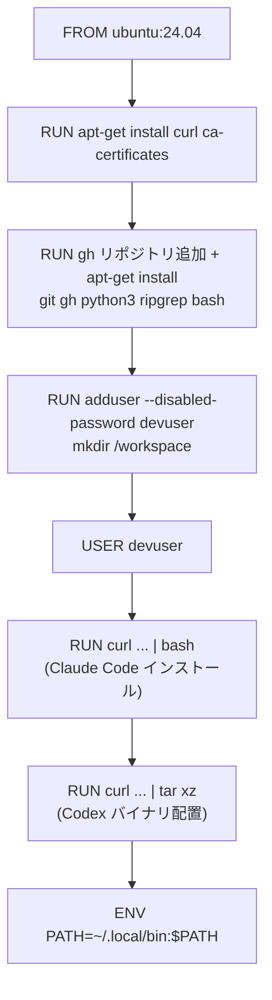
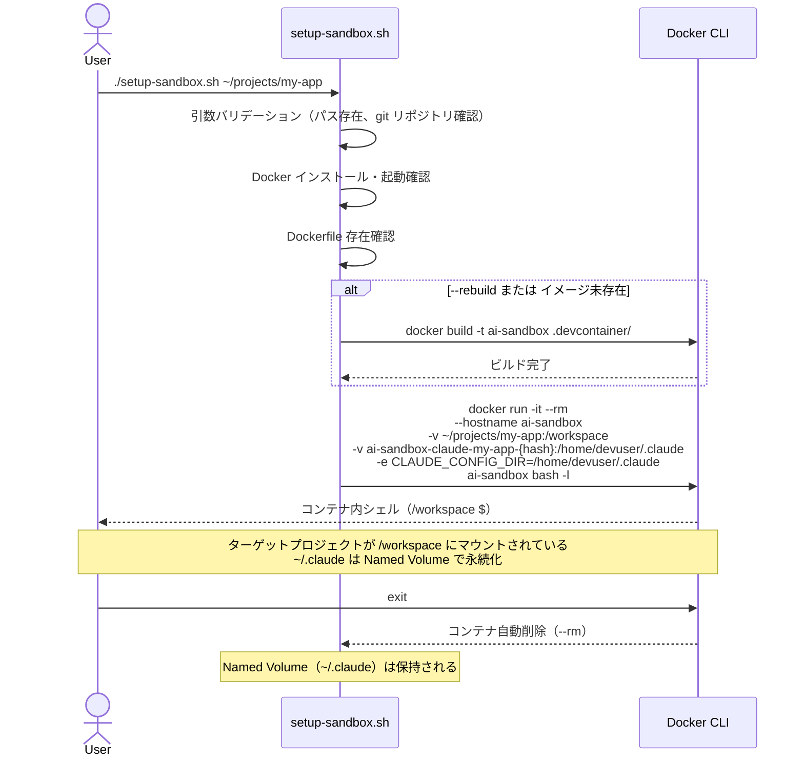
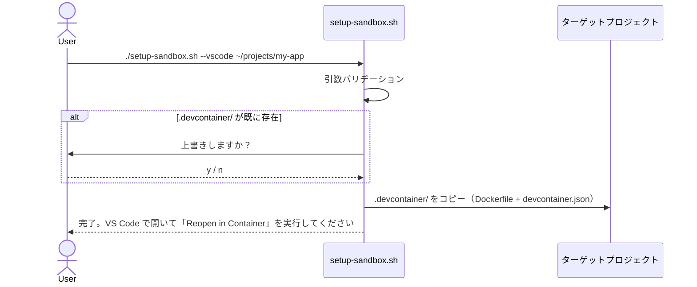
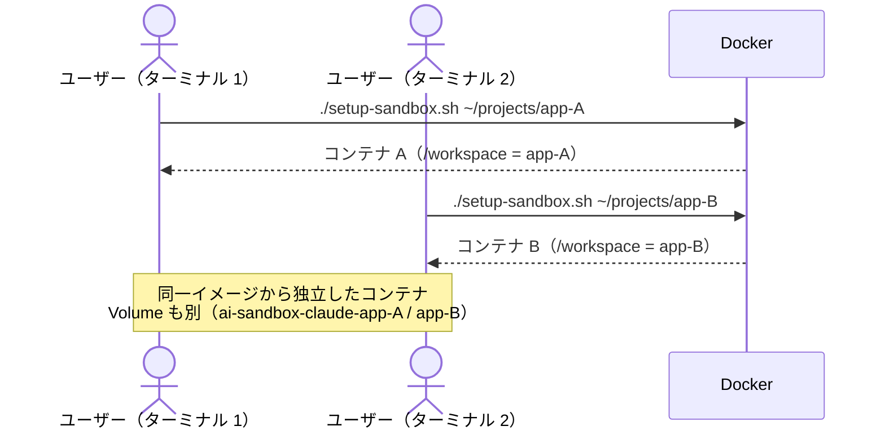

# DES-001 AI Sandbox 設計書

## メタデータ

| 項目     | 値                                        |
| -------- | ----------------------------------------- |
| 設計ID   | DES-001                                   |
| 関連要件 | APP-001, FNC-001, FNC-002, FNC-003, FNC-004 |
| 作成日   | 2026-03-29                                |

## 1. 概要

AI コーディングアシスタント（Claude Code、OpenAI Codex）をネイティブバイナリとしてプリインストールした Ubuntu 24.04 ベースの Docker コンテナを設計する。`setup-sandbox.sh` スクリプトを唯一のエントリポイントとし、ターミナル起動（方式 A）と VS Code DevContainer 配置（方式 B）の両方に対応する。

**設計判断の要点:**
- ベースイメージに Ubuntu 24.04 を採用（glibc 環境。Claude Code のネイティブバイナリが動作する）
- npm / Node.js を使用しない（Anthropic 公式 DevContainer Feature との差別化）
- `setup-sandbox.sh` が唯一のエントリポイント（ターミナル起動と VS Code 配置を統合）
- Trail of Bits の `claude-code-devcontainer` を参考にしつつ、汎用的な開発用途に最適化

## 2. アーキテクチャ概要

### 2.1 コンポーネント構成図



### 2.2 レイヤー構成

| レイヤー | 責務 | 対応ファイル |
| --- | --- | --- |
| コンテナイメージ | AI ツールのプリインストール、実行環境の構築 | `.devcontainer/Dockerfile` |
| エントリポイント | コンテナ起動 / VS Code 配置の統合インターフェース | `setup-sandbox.sh` |
| DevContainer 設定 | VS Code 連携、拡張機能推奨 | `.devcontainer/devcontainer.json` |
| Docker 環境構築 | macOS 向け Docker/Colima セットアップ | `Makefile`（既存、変更なし） |

## 3. モジュール設計

### 3.1 モジュール一覧

| モジュール | 責務 | 入力 | 出力 | 依存 |
| --- | --- | --- | --- | --- |
| Dockerfile | コンテナイメージのビルド定義 | Ubuntu ベースイメージ、Claude/Codex インストーラー | Docker イメージ | Docker Hub, claude.ai, GitHub Releases |
| setup-sandbox.sh | ターミナル起動 / VS Code 配置の統合エントリポイント | ターゲットプロジェクトパス、オプション | 起動済みコンテナ / 配置済み .devcontainer/ | Docker CLI, Dockerfile |
| devcontainer.json | VS Code DevContainer 構成 | Dockerfile | VS Code 内のコンテナ接続 | Dockerfile |
| Makefile | macOS Docker 環境セットアップ | Homebrew | Docker CLI, Colima, Buildx | Homebrew |

### 3.2 Dockerfile 設計



**設計判断:**

| 判断 | 選択 | 理由 | 代替案（却下） |
| --- | --- | --- | --- |
| ベースイメージ | `ubuntu:24.04` | glibc 環境。Claude Code のネイティブバイナリが動作する。LTS で 2029年4月までサポート | Alpine Linux（musl 非互換で Claude Code 起動不可） |
| ユーザー名 | `devuser` | 非 root ユーザーでセキュリティ確保。コンテナ固有の名前 | `root`（セキュリティリスク）、`ubuntu`（デフォルトユーザーとの混同回避） |
| Claude Code インストール | `curl \| bash`（公式インストーラー） | 公式サポートされた唯一のネイティブインストール方法 | npm パッケージ（Node.js 依存を導入するため却下。公式 Feature と差別化不能） |
| Codex インストール | GitHub Releases から glibc バイナリを直接取得 | npm 不要。Ubuntu では glibc バイナリが動作する | musl バイナリ（Alpine 用。Ubuntu では glibc が標準） |
| Codex アーキテクチャ | ビルド時に `dpkg --print-architecture` で検出し、`amd64` / `arm64` に対応するバイナリを選択 | Ubuntu では `dpkg --print-architecture` が最も信頼性が高い | `uname -m`（Ubuntu でも動作するが `dpkg` がより標準的） |
| PATH 設定 | `ENV PATH="/home/devuser/.local/bin:$PATH"` | Dockerfile の `ENV` は全シェル種別に適用される | `~/.profile` のみ（非ログインシェルで PATH が通らない問題あり） |

**セキュリティリスク受容:**

| リスク | 緩和策 | 受容理由 |
| --- | --- | --- |
| `curl \| bash` による MITM / サプライチェーン攻撃 | HTTPS（TLS）経由でのみ取得 | Anthropic 公式が唯一サポートする方法。接続先は `claude.ai` の公式ドメイン |
| Codex バイナリの完全性未検証 | GitHub Releases の公式アセットから HTTPS 取得 | OpenAI 公式リリースからの取得。現時点でチェックサムファイルが公式提供されていない |

**ネットワーク要件:**

Docker のデフォルト設定でコンテナからインターネットへのアウトバウンド通信が可能であり、AI ツールの API 通信（api.anthropic.com、api.openai.com 等）に必要。docker run に特別なネットワーク設定は不要（デフォルトの bridge ネットワークを使用）。

**ツールバージョン戦略:**

| ツール | バージョン戦略 | 理由 |
| --- | --- | --- |
| Claude Code | `curl \| bash` で実行時点の最新版 | 公式インストーラーがバージョン指定に非対応 |
| Codex | GitHub Releases の `latest` | 開発用途のため常に最新版を使用。バージョン固定が必要な場合は Dockerfile で `ARG CODEX_VERSION` を導入して対応する |

いずれもビルドタイミングによって異なるバージョンがインストールされる。要件定義書（APP-001）の成功基準は「ツールの存在確認（`--help` が成功すること）」であり、バージョン一致は求めない。

**ビルドエラーハンドリング:**

Dockerfile 内の `curl | bash` や `curl | tar` が失敗した場合、`set -e` により RUN ステップ全体がエラーとなり docker build が停止する。Ubuntu のデフォルトシェル `/bin/sh`（dash）は `pipefail` 非対応のため、`bash -o pipefail -c` でパイプ失敗を検出する。

**Dockerfile の具体的な処理フロー:**

1. Ubuntu 24.04 をベースイメージとする
2. curl, ca-certificates を先行インストールし、gh (GitHub CLI) 公式 apt リポジトリを追加。git, gh, python3, ripgrep, bash を一括インストール
3. 非 root ユーザー `devuser` を作成し、`/workspace` ディレクトリの所有権を付与
4. `devuser` に切り替え
5. Claude Code を公式インストーラーでインストール（`~/.local/bin/claude` に配置される）
6. OpenAI Codex を GitHub Releases から glibc バイナリとしてダウンロードし、`~/.local/bin/codex` に配置
7. `ENV PATH` で `~/.local/bin` を PATH に追加

**Colima メモリ要件:**

Claude Code インストーラーが Docker ビルド時にメモリを消費し、実行時も Claude Code プロセスが大量のメモリを使用するため、macOS（Colima）では **8GiB 以上のメモリ割り当て**が必要（`colima start --memory 8`）。4GiB ではビルドは成功するが実行時に OOM Kill される場合がある。

### 3.3 setup-sandbox.sh 設計

**設計判断: 方式 A と方式 B を1つのスクリプトに統合する理由**

方式 A（ターミナル起動: `docker run`）と方式 B（VS Code 配置: ファイルコピー）は本質的に異なる操作だが、以下の理由で1つのスクリプトに統合する:

- ユーザーが覚えるコマンドが1つで済む
- Dockerfile のパス解決ロジック（自身のリポジトリ内の `.devcontainer/Dockerfile` を参照）を共有できる
- 将来的に方式 C（例: `--detach` でバックグラウンド起動）を追加する場合もオプション追加で対応可能

代替案として `sandbox-run.sh` と `sandbox-setup-vscode.sh` に分離する案もあるが、共通ロジック（バリデーション、Dockerfile パス解決）の重複が生じるため却下した。

**Dockerfile パス解決:**

`setup-sandbox.sh` は自身のスクリプトが存在するディレクトリを基準に Dockerfile を検索する:

```bash
SCRIPT_DIR="$(cd "$(dirname "$0")" && pwd)"
DOCKERFILE_PATH="${SCRIPT_DIR}/.devcontainer/Dockerfile"
```

これにより、ユーザーがどのディレクトリから実行しても正しく Dockerfile を参照できる。

**シェル言語:** `#!/bin/bash`（bash 固有機能を使用するため。macOS / Linux ともに bash は標準で利用可能）

**コマンド構文:**

```
setup-sandbox.sh [OPTIONS] <target-project-path>
setup-sandbox.sh --vscode <target-project-path>
setup-sandbox.sh --rebuild <target-project-path>
setup-sandbox.sh -h | --help
```

**オプション:**

| オプション | 動作 |
| --- | --- |
| （なし） | ターゲットプロジェクトをマウントしてコンテナを起動し、シェルに入る |
| `--vscode` | ターゲットプロジェクトに `.devcontainer/` を配置する（コンテナは起動しない） |
| `--rebuild` | イメージを強制再ビルドしてからコンテナを起動する |
| `-h`, `--help` | 使い方を表示する |

**処理フロー（方式 A: ターミナル起動）:**



**処理フロー（方式 B: VS Code 配置）:**



**docker run コマンドの設計:**

```bash
docker run -it --rm \
    --hostname ai-sandbox \
    -v "${TARGET_PATH}:/workspace" \
    -v "ai-sandbox-claude-${PROJECT_NAME}:/home/devuser/.claude" \
    -w /workspace \
    -e CLAUDE_CONFIG_DIR=/home/devuser/.claude \
    -e OPENAI_API_KEY \
    -e ANTHROPIC_API_KEY \
    ai-sandbox bash -l
```

| フラグ | 目的 |
| --- | --- |
| `-it` | 対話的ターミナル |
| `--rm` | コンテナ終了時に自動削除 |
| `--hostname ai-sandbox` | ホスト名を固定。ランダムホスト名では再起動ごとに Claude Code が認証を無効と判定する場合があるため固定値を使用 |
| `-v ${TARGET_PATH}:/workspace` | ターゲットプロジェクトを bind mount（Docker の bind mount はファイルシステムレベルで即時双方向同期。FNC-002 のリアルタイム同期要件を充足する） |
| `-v ai-sandbox-claude-${PROJECT_NAME}:/home/devuser/.claude` | Claude Code 認証情報を Named Volume で永続化（FNC-002 データ永続化要件） |
| `-e CLAUDE_CONFIG_DIR=/home/devuser/.claude` | Claude Code の設定ディレクトリを明示的に指定。未設定の場合、`~/.claude.json`（OAuth セッション状態）が Named Volume 外のホームディレクトリに書き込まれ認証が失われる（公式 Issue [#14313](https://github.com/anthropics/claude-code/issues/14313)） |
| `-e OPENAI_API_KEY` | ホストの `$OPENAI_API_KEY` をコンテナに転送（Codex の API 認証用。未設定の場合は何も渡されない） |
| `-e ANTHROPIC_API_KEY` | ホストの `$ANTHROPIC_API_KEY` をコンテナに転送（Claude Code が API キー認証を使用する場合。OAuth 認証の場合は不要） |
| `-w /workspace` | ワーキングディレクトリ |
| `bash -l` | ログインシェル（`~/.profile` を読み込む） |

**環境変数転送の設計:**

`docker run -e VAR_NAME`（値なし）の形式で、ホスト側の同名環境変数をコンテナに転送する。ホスト側で未設定の場合は何も渡されず、各ツール固有の認証エラーとなる（ユーザーの責務）。

- **Claude Code**: 主に `~/.claude/` の OAuth 認証を使用（Volume + `CLAUDE_CONFIG_DIR` で永続化）。API キー認証を使用する場合は `ANTHROPIC_API_KEY` を転送
- **Codex**: `OPENAI_API_KEY` 環境変数で認証

**`.gitignore` について:** AI Sandbox リポジトリの `.gitignore` には `.env` が含まれている。ターゲットプロジェクトの `.gitignore` 管理は本プロジェクトの責務外。

**Volume 命名規則:**

Named Volume 名にプロジェクト名を含めることで、プロジェクトごとに独立した Claude Code 設定を保持する。

```
ai-sandbox-claude-{basename}-{path-hash}
```

`basename` はターゲットパスの末尾ディレクトリ名、`path-hash` はターゲットの絶対パスの SHA-256 先頭8文字（例: `~/projects/my-app` → `my-app-a1b2c3d4`）。

```bash
PROJECT_NAME="$(basename "${TARGET_PATH}")-$(echo -n "${TARGET_PATH}" | shasum -a 256 | cut -c1-8)"
```

**衝突回避の設計:** `basename` のみでは異なるパスに同名ディレクトリが存在する場合に同一 Volume が共有される問題があったため、フルパスのハッシュを付与して一意性を確保した。`basename` を残すことで `docker volume ls` 時の人間による識別を維持している。

**エラーハンドリング:**

| 条件 | 処理 | 終了コード |
| --- | --- | --- |
| Docker 未インストール | エラーメッセージを表示して終了 | 1 |
| Docker 未起動 | エラーメッセージを表示して終了 | 1 |
| ターゲットパス未指定 | 使い方を表示して終了 | 1 |
| ターゲットパスが存在しない | エラーメッセージを表示して終了 | 1 |
| ターゲットが git リポジトリでない | エラーメッセージを表示して終了 | 1 |
| Dockerfile 未検出 | エラーメッセージを表示して終了 | 1 |
| イメージビルド失敗 | エラーメッセージを表示して終了 | 1 |
| 不明なオプション | 使い方を表示して終了 | 1 |

### 3.4 devcontainer.json 設計

```json
{
  "name": "AI Sandbox",
  "build": {
    "dockerfile": "./Dockerfile"
  },
  "remoteUser": "devuser",
  "mounts": [
    "source=ai-sandbox-claude-${localWorkspaceFolderBasename},target=/home/devuser/.claude,type=volume"
  ],
  "customizations": {
    "vscode": {
      "extensions": [
        "Anthropic.claude-code"
      ]
    }
  }
}
```

**設計判断:**

| 判断 | 選択 | 理由 |
| --- | --- | --- |
| `remoteUser` | `devuser` | Dockerfile で作成した非 root ユーザー |
| `postCreateCommand` | なし | 全ツールがイメージにプリインストール済み |
| DevContainer 再オープン提案 | `.devcontainer/` の存在のみで VS Code がデフォルトで提案する | 追加実装不要。FNC-001 の要件は `.devcontainer/devcontainer.json` の配置で自動的に充足される |
| Named Volume | `ai-sandbox-claude-${localWorkspaceFolderBasename}` | Claude Code 認証情報の永続化。プロジェクトごとに独立 |
| VS Code 拡張 | `Anthropic.claude-code` のみ | Claude Code の VS Code 拡張を自動推奨。Codex は CLI ツールであり公式 VS Code 拡張が存在しないため含めない |

### 3.5 Makefile 設計

既存の Makefile に **Colima 起動時のメモリ割り当てを 8GiB に変更**する修正を加える。

| ターゲット | 処理 | 変更点 |
| --- | --- | --- |
| `install` | Docker CLI + Colima + Buildx をインストールし Colima を起動 | `colima start` → `colima start --memory 8` に変更 |
| `uninstall` | 全コンポーネントをアンインストール | 変更なし |
| `help` | 利用可能なターゲットを表示 | 変更なし |

**設計判断:** Claude Code はビルド時・実行時ともに大量のメモリを消費するため、Colima のデフォルトメモリ（2GiB）ではビルドが失敗し、4GiB でも実行時に OOM Kill される場合がある。`make install` で自動的に 8GiB を確保することで安定動作を保証する。

### 3.6 モジュール間共有定数

以下の値が Dockerfile・setup-sandbox.sh・devcontainer.json で暗黙的に共有される。変更する場合は全ファイルを同時に更新する必要がある。

| 定数 | 値 | 使用箇所 |
| --- | --- | --- |
| ユーザー名 | `devuser` | Dockerfile（`adduser`）、devcontainer.json（`remoteUser`） |
| イメージ名 | `ai-sandbox` | setup-sandbox.sh（`docker build -t`、`docker run`） |
| ワークスペースパス | `/workspace` | Dockerfile（`mkdir`）、setup-sandbox.sh（`-v ...:/workspace`）、devcontainer.json |
| Claude Code 設定パス | `/home/devuser/.claude` | setup-sandbox.sh（Named Volume マウント先）、devcontainer.json（`mounts`） |
| Volume 名プレフィックス | `ai-sandbox-claude-` | setup-sandbox.sh、devcontainer.json |

## 4. ユースケース設計

### 4.1 ユースケース一覧

| ユースケース | 関連要件 | 説明 |
| --- | --- | --- |
| UC-1: ターミナルで AI ツール実行 | FNC-002, FNC-003 | `setup-sandbox.sh` でコンテナ起動し、claude/codex を実行 |
| UC-2: VS Code DevContainer 起動 | FNC-001 | `setup-sandbox.sh --vscode` で配置後、VS Code で接続 |
| UC-3: macOS Docker セットアップ | FNC-004 | `make install` で Docker 環境を構築 |
| UC-4: イメージの更新 | FNC-002 | `setup-sandbox.sh --rebuild` で最新ツールに更新 |
| UC-5: 複数プロジェクト同時利用 | FNC-002 | 別ターミナルで別プロジェクトを同時起動 |

### 4.2 UC-5: 複数プロジェクト同時利用（シーケンス図）



## 5. 使用する既存コンポーネント

| コンポーネント | ファイルパス | 用途 | 変更の要否 |
| --- | --- | --- | --- |
| Makefile | `Makefile` | macOS Docker セットアップ | 変更なし |
| MAKEFILE_GUIDE.md | `MAKEFILE_GUIDE.md` | Makefile の解説 | Colima メモリ要件の追記が必要 |

**Trail of Bits 参考実装との差分（採否判断）:**

| Trail of Bits の要素 | 本設計での採否 | 理由 |
| --- | --- | --- |
| `bubblewrap`（サンドボックス支援） | ❌ 不採用 | Claude Code 自身のサンドボックス機能を使用。追加の隔離層は本プロジェクトのスコープ外 |
| `init: true`（PID 1 問題対策） | ❌ 不採用 | 対話的な短期間利用（`--rm`）であり、シグナル伝播の問題は実用上発生しにくい |
| zsh / Oh My Zsh | ❌ 不採用 | bash で十分。シンプルさを優先 |
| Python 3（ランタイムのみ） | ✅ 採用 | AI アシスタントがスクリプト実行に使用。pip / uv / フレームワークは含めない |
| gh (GitHub CLI) | ✅ 採用 | AI アシスタントが PR 作成・Issue 操作等に使用。公式 apt リポジトリから取得 |
| 認証トークン転送（`post_install.py`） | ❌ 不採用 | Claude Code の対話的認証 + Named Volume 永続化で対応。トークン管理の複雑さを避ける |
| iptables ネットワーク制限 | ❌ 不採用 | 汎用開発用途では過度な制限。セキュリティ監査向けの Trail of Bits とはユースケースが異なる |
| tmux / fzf / delta | ❌ 不採用 | 開発支援ツールの提供は本プロジェクトのスコープ外。ユーザーが必要に応じてインストール |
| `NODE_OPTIONS=--max-old-space-size` | ❌ 不採用 | npm / Node.js を使用しない方針 |
| `--cap-add=NET_ADMIN,NET_RAW` | ❌ 不採用 | iptables 不採用のため不要 |
| `SHELL ["/bin/bash", "-o", "pipefail", "-c"]` | ✅ 採用 | Dockerfile の RUN 命令で pipefail を有効化 |

**参考実装（設計のモデルとして参照。コードの直接再利用はしない）:**

| コンポーネント | パス | 参考にする点 |
| --- | --- | --- |
| Trail of Bits Dockerfile | `specs/references/claude-code-devcontainer/Dockerfile` | Ubuntu ベースの構成、Claude Code ネイティブインストール、Volume 永続化パターン |
| Trail of Bits devcontainer.json | `specs/references/claude-code-devcontainer/devcontainer.json` | Named Volume 構成、VS Code 設定、環境変数設計 |

## 6. テスト設計

### 6.1 単体テスト

| テスト対象 | テスト内容 | 検証方法 |
| --- | --- | --- |
| Dockerfile ビルド | イメージが正常にビルドできること | `docker build` の終了コード 0 |
| Claude Code 動作 | `claude --help` が動作すること | コンテナ内で実行、終了コード 0 |
| Codex 動作 | `codex --help` が動作すること | コンテナ内で実行、終了コード 0 |
| gh 動作 | `gh --version` が動作すること | コンテナ内で実行、終了コード 0 |
| python3 動作 | `python3 --version` が動作すること | コンテナ内で実行、終了コード 0 |
| PATH 設定 | `which claude && which codex` が成功すること | コンテナ内で実行 |
| setup-sandbox.sh --help | ヘルプが表示されること | 標準出力の確認 |
| setup-sandbox.sh（存在しないパス） | エラーを表示して終了コード 1 | |
| setup-sandbox.sh（git リポジトリでないパス） | エラーを表示して終了コード 1 | |
| setup-sandbox.sh --vscode | `.devcontainer/` がターゲットにコピーされること | ターゲットディレクトリの確認 |
| セキュリティ | ホストのファイルにアクセスできないこと | `ls /home/` にホストユーザーが存在しないこと |

### 6.2 統合テスト

| テスト対象 | テスト内容 |
| --- | --- |
| ターミナル E2E | `setup-sandbox.sh <パス>` → `claude --help` → `exit` で正常終了 |
| VS Code E2E | `setup-sandbox.sh --vscode <パス>` → VS Code「Reopen in Container」→ `claude --help` |
| Volume 永続化 | コンテナ起動 → Claude Code 認証 → `exit` → 再起動 → 認証が保持されていること |
| 複数プロジェクト | 2つのターミナルで別プロジェクトを同時起動し、互いに干渉しないこと |
| macOS フルセットアップ | `make install` → `colima start --memory 8` → `docker build` → `setup-sandbox.sh` → `claude --help` |

## 改定履歴

| 日付 | バージョン | 内容 |
| --- | --- | --- |
| 2026-03-29 | 1.0 | 初版作成。Ubuntu 24.04 ベース、setup-sandbox.sh 統合エントリポイント、Named Volume 永続化 |
| 2026-03-30 | 1.1 | 認証永続化の設計を更新: `CLAUDE_CONFIG_DIR`・`--hostname` 追加、Volume 命名にフルパスハッシュを採用 |
| 2026-03-30 | 1.2 | 標準ツール追加: gh (GitHub CLI)、python3 をプリインストール対象に変更 |
