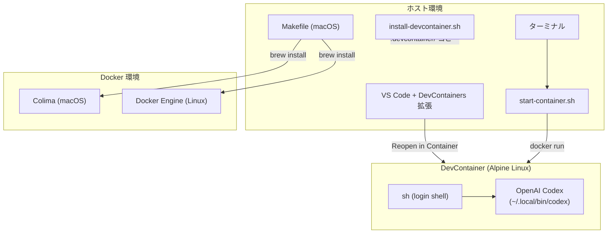
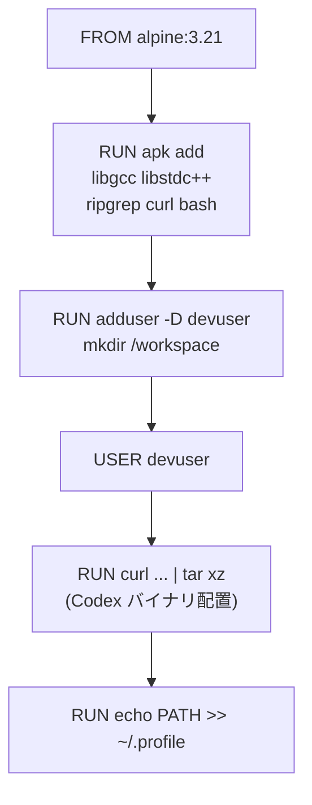
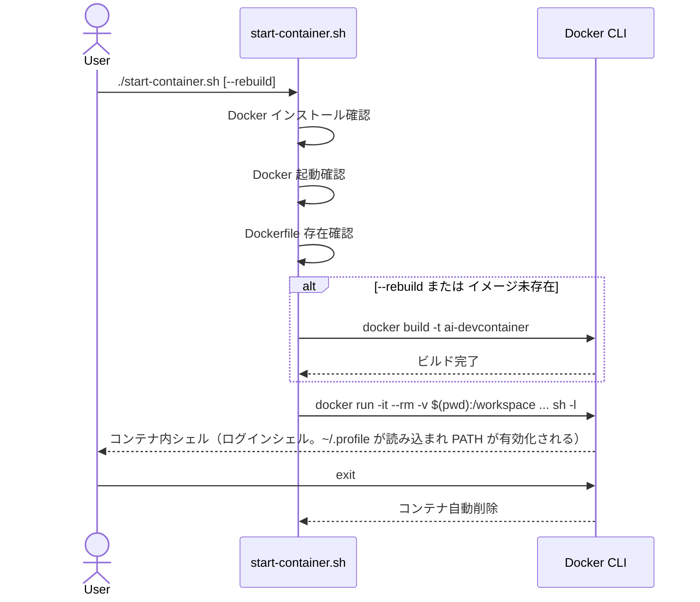
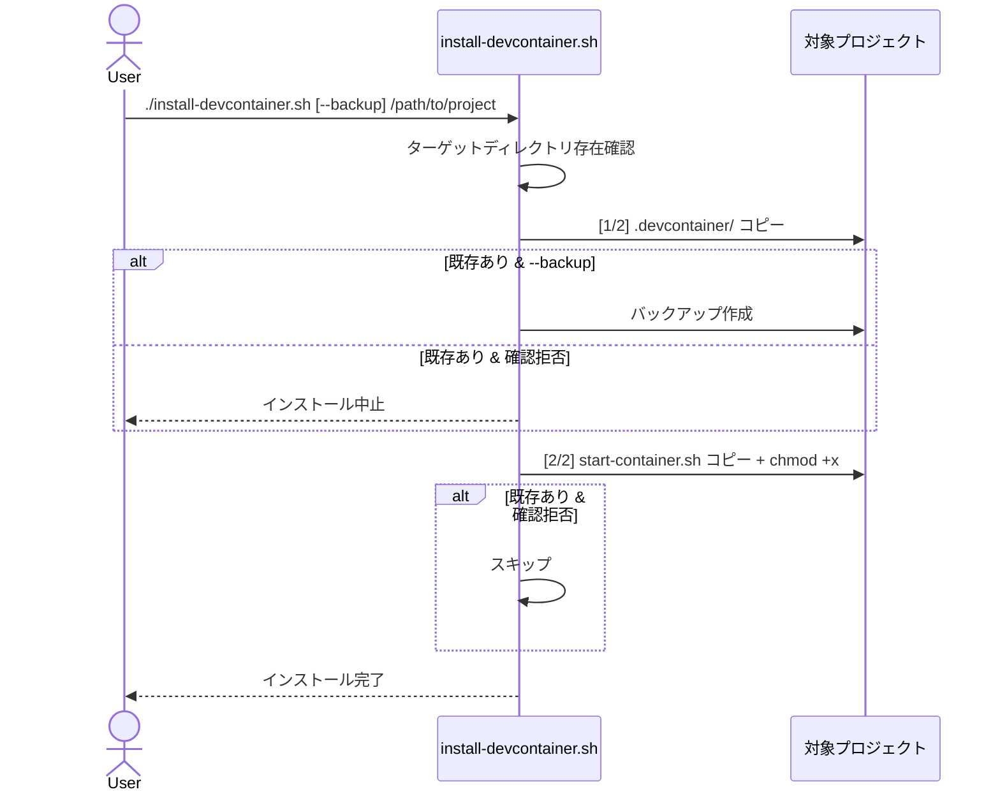
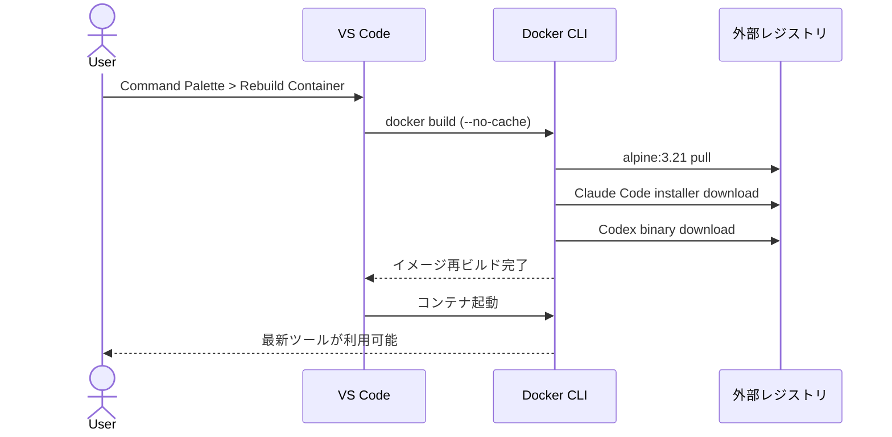

# DES-001 AI DevContainer 設計書

## メタデータ

| 項目     | 値                                        |
| -------- | ----------------------------------------- |
| 設計ID   | DES-001                                   |
| 関連要件 | APP-001, FNC-001, FNC-002, FNC-003, FNC-004, FNC-005 |
| 作成日   | 2026-03-28                                |

## 1. 概要

AI コーディングアシスタント（Claude Code, OpenAI Codex）をネイティブバイナリとしてプリインストールした Alpine Linux ベースの DevContainer を設計する。npm / Node.js を使用せず、コンテナ起動時の追加インストールを排除することで、軽量かつ高速な起動を実現する。

**設計判断の要点:**
- ベースイメージに純粋な Alpine Linux を採用（Node.js イメージではない）
- 全ツールをネイティブバイナリとしてビルド時にインストール
- package.json / npm / node_modules を完全に排除

## 2. アーキテクチャ概要

### 2.1 コンポーネント構成図



### 2.2 レイヤー構成

| レイヤー | 責務 | 対応ファイル |
| --- | --- | --- |
| コンテナイメージ | AI ツールのプリインストール、実行環境の構築 | `.devcontainer/Dockerfile` |
| DevContainer 設定 | VS Code 連携、拡張機能推奨 | `.devcontainer/devcontainer.json` |
| コンテナ起動 | コンソールからのコンテナ起動・管理 | `start-container.sh` |
| Docker 環境構築 | macOS 向け Docker/Colima セットアップ | `Makefile` |
| インストーラー | 既存プロジェクトへの環境配布 | `install-devcontainer.sh` |

## 3. モジュール設計

### 3.1 モジュール一覧

| モジュール | 責務 | 入力 | 出力 | 依存 |
| --- | --- | --- | --- | --- |
| Dockerfile | コンテナイメージのビルド定義 | Alpine ベースイメージ、Claude/Codex インストーラー | Docker イメージ | Docker Hub, claude.ai, GitHub Releases |
| devcontainer.json | VS Code DevContainer 構成 | Dockerfile | VS Code 内のコンテナ接続 | Dockerfile |
| start-container.sh | コンソールからのコンテナ起動 | Docker イメージ、カレントディレクトリ | 起動済みコンテナのシェル | Docker CLI, Dockerfile |
| Makefile | macOS Docker 環境セットアップ | Homebrew | Docker CLI, Colima, Buildx | Homebrew |
| install-devcontainer.sh | 既存プロジェクトへのファイルコピー | AI DevContainer リポジトリ | 対象プロジェクトの .devcontainer/ 等 | なし |

### 3.2 Dockerfile 設計



**設計判断:**

| 判断 | 選択 | 理由 | 代替案 |
| --- | --- | --- | --- |
| ベースイメージ | `alpine:3.21` | 軽量（~7MB）、musl 互換ツールが利用可能 | `node:24-alpine`（~60MB、Node.js 不要なので却下） |
| ユーザー名 | `devuser` | `node` ユーザーは Node.js イメージ固有のため変更 | `node`（Alpine にはデフォルトで存在しない） |
| Claude Code | ホスト側 VS Code 拡張として使用（コンテナ内にはインストールしない） | Linux musl バイナリが Alpine musl と非互換（`posix_getdents` シンボル未対応） | `curl \| bash` でコンテナ内インストール（musl 非互換のため却下） |
| Codex インストール | GitHub Releases から musl バイナリを直接取得 | npm 不要、musl 互換バイナリが公式提供 | npm install（Node.js 依存を復活させるため却下） |
| Codex アーキテクチャ | ビルド時に `uname -m` でアーキテクチャを検出し、`x86_64-unknown-linux-musl` または `aarch64-unknown-linux-musl` を選択 | Alpine Linux は x86_64（Intel Mac / Linux）と arm64（Apple Silicon）の両方で動作する | アーキテクチャ固定（マルチアーキテクチャ対応が不可能になるため却下） |

**セキュリティリスク受容:**

| リスク | 緩和策 | 受容理由 |
| --- | --- | --- |
| Codex バイナリの完全性未検証 | GitHub Releases の公式アセットから HTTPS 取得 | OpenAI 公式リリースからの取得であり、現時点でチェックサムファイルが公式提供されていない |
| Codex バージョン | latest タグの musl バイナリ | Docker Hub API または GitHub API で最新版を取得 | バージョン固定（再現性は高いが更新が手動になる） |
| PATH 設定 | `~/.profile` に追記 | Alpine のログインシェルが `.profile` を読む | `/etc/profile.d/`（システム全体への影響を避ける） |

**Dockerfile の具体的な処理フロー:**

1. Alpine 3.21 をベースイメージとする
2. Codex に必要なパッケージ（libgcc, libstdc++, ripgrep, curl, bash）をインストール
3. 非 root ユーザー `devuser` を作成し、`/workspace` ディレクトリの所有権を付与
4. `devuser` に切り替え
5. OpenAI Codex を GitHub Releases から musl バイナリとしてダウンロードし、`~/.local/bin/codex` に配置
6. `~/.profile` に PATH（`$HOME/.local/bin`）を設定

> **注記**: Claude Code はコンテナ内にインストールしない。Linux musl バイナリが Alpine の musl ライブラリと非互換（`posix_getdents` シンボル未対応）のため。ホスト側の VS Code 拡張（`Anthropic.claude-code`）として使用する。

### 3.3 devcontainer.json 設計

```json
{
  "name": "ai-dev-container",
  "build": {
    "dockerfile": "./Dockerfile",
    "context": ".."
  },
  "remoteUser": "devuser",
  "customizations": {
    "vscode": {
      "extensions": [
        "Anthropic.claude-code"
      ]
    }
  }
}
```

**変更点（旧設計からの差分）:**
- `postCreateCommand: "npm install"` を削除（プリインストール済みのため不要）
- `remoteUser` を `node` → `devuser` に変更
- `google.gemini-code-assist` 拡張機能を削除

### 3.4 start-container.sh 設計

**起動モード:**

| モード | コマンド | 動作 |
| --- | --- | --- |
| 通常 | `./start-container.sh` | DevContainer イメージでコンテナ起動。未ビルドなら自動ビルド |
| 再ビルド | `./start-container.sh --rebuild` | イメージを強制再ビルドして起動 |
| ヘルプ | `./start-container.sh --help` | 使い方を表示 |

**削除する機能:**
- `--node` モード: APP-001 の成功基準対象外であり、ネイティブインストール方針では意味をなさない（公式 Alpine イメージに AI ツールは入っていない）
- `npm install` の実行: 全ツールがイメージにプリインストール済み

**処理フロー:**



### 3.5 install-devcontainer.sh 設計

**インストールステップ（2ステップ）:**

| ステップ | 対象 | 種別 | 上書き拒否時の動作 |
| --- | --- | --- | --- |
| [1/2] | `.devcontainer/` | 必須 | インストール中止 |
| [2/2] | `start-container.sh` | オプション | スキップ継続 |

**削除する処理:**
- package.json マージ（npm 不要）
- .gitignore への node_modules 追加（node_modules 不要）
- Makefile コピー（既存プロジェクトの Makefile と衝突するため。macOS Docker セットアップは AI DevContainer リポジトリで実行）

**処理フロー:**



### 3.6 Makefile 設計

既存の Makefile 設計は要件を満たしており、変更不要。

| ターゲット | 処理 |
| --- | --- |
| `install` | Docker CLI + Colima + Buildx をインストールし Colima を起動 |
| `uninstall` | 全コンポーネントをアンインストール |
| `help` | 利用可能なターゲットを表示 |

## 4. ユースケース設計

### 4.1 ユースケース一覧

| ユースケース | 関連要件 | 説明 |
| --- | --- | --- |
| UC-1: VS Code で DevContainer 起動 | FNC-001 | VS Code で「Reopen in Container」を実行しコンテナ接続 |
| UC-2: ターミナルからコンテナ起動 | FNC-002 | start-container.sh でコンテナ起動してシェルに入る |
| UC-3: AI ツール実行 | FNC-003 | コンテナ内で claude/codex コマンドを実行 |
| UC-4: macOS Docker セットアップ | FNC-004 | make install で Docker 環境を構築 |
| UC-5: 既存プロジェクトへの導入 | FNC-005 | install-devcontainer.sh で環境をコピー |
| UC-6: コンテナイメージの更新 | FNC-001 | ツール更新のためイメージを再ビルド |

### 4.2 UC-6: コンテナイメージの更新（シーケンス図）



## 5. 使用する既存コンポーネント

| コンポーネント | ファイルパス | 用途 | 変更の要否 |
| --- | --- | --- | --- |
| Makefile | `Makefile` | macOS Docker セットアップ | 変更なし |
| Dockerfile | `.devcontainer/Dockerfile` | コンテナイメージ定義 | 全面書き換え |
| devcontainer.json | `.devcontainer/devcontainer.json` | VS Code 設定 | 修正 |
| start-container.sh | `start-container.sh` | コンテナ起動スクリプト | 修正 |
| install-devcontainer.sh | `install-devcontainer.sh` | インストーラー | 修正 |

> **注意**: 現行の実装はネイティブインストール方針移行前の旧方式（ベースイメージ `node:24-alpine`、ユーザー `node`、npm 依存）のままである。この設計書に従って全面書き換えが必要。

## 6. テスト設計

### 6.1 単体テスト

| テスト対象 | テスト内容 | 検証方法 |
| --- | --- | --- |
| Dockerfile ビルド | イメージが正常にビルドできること | `docker build` の終了コード 0 |
| Codex 動作 | `codex --help` が動作すること | コンテナ内で実行、終了コード 0 |
| PATH 設定 | `which codex` が成功すること | ログインシェルで実行 |
| start-container.sh | 通常モードでコンテナ起動できること | スクリプト実行後にシェルが起動 |
| start-container.sh --rebuild | 再ビルドモードでイメージが更新されること | ビルド実行の確認 |
| start-container.sh --help | ヘルプが表示されること | 標準出力の確認 |
| install-devcontainer.sh | 2ファイルが正しくコピーされること | ターゲットディレクトリの確認 |

### 6.2 統合テスト

| テスト対象 | テスト内容 |
| --- | --- |
| VS Code DevContainer 起動 | VS Code で「Reopen in Container」→ コンテナ接続 → codex 実行 |
| install → 起動 | install-devcontainer.sh → 対象プロジェクトで DevContainer 起動 |
| macOS フルセットアップ | make install → colima start → docker build → コンテナ起動 → AI ツール実行 |

## 改定履歴

| 日付 | バージョン | 内容 |
| --- | --- | --- |
| 2026-03-28 | 1.0 | 初版作成。ネイティブバイナリ方針での設計 |
| 2026-03-28 | 1.1 | レビュー指摘反映：ステップ番号修正、現行実装との差分注記追加、セキュリティリスク受容表を追加 |
| 2026-03-28 | 1.2 | Claude Code をコンテナから除外（Linux musl 非互換）。Codex のみコンテナ内インストールに変更。Colima 4GiB 要件を削除 |
| 2026-03-28 | 1.2 | レビュー指摘反映：start-container.sh シーケンス図に sh -l を明記、Codex アーキテクチャ検出方針を設計判断テーブルに追加 |
