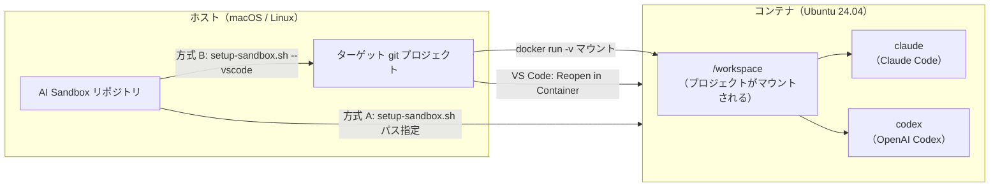

# APP-001 AI Sandbox 要件定義書

## 概要

AI コーディングアシスタント（Claude Code、OpenAI Codex）をコンテナ内にプリインストールし、git 管理された開発プロジェクトに対して安全に AI 支援開発を行える環境を提供する。

**最大の目標**: 開発者が自身の git プロジェクトにおいて、コンテナのターミナルから `claude` コマンドを実行し、安全に AI コーディング支援を受けられること。

## 技術選定の経緯

本プロジェクトでは、ベースイメージの選定にあたり複数の候補を調査・検証した。この経緯は要件を正しく理解するための背景知識として記録する。

### なぜコンテナに入れるのか — セキュリティ上の動機

AI コーディングアシスタント（Claude Code、Codex）はコードの生成・実行・ファイル操作を自律的に行うツールである。ホスト環境で直接実行すると、以下のリスクが生じる:

- ホストのファイルシステム全体にアクセス可能（`~/.ssh`、`~/.aws` 等の機密情報を含む）
- ホストのプロセスに対して操作が可能
- 意図しないシステム変更が直接ホストに影響する

コンテナ技術を使うことで、これらのリスクをファイルシステム分離・プロセス分離によって緩和できる。

### コンテナの分離モデル — macOS における構造

macOS では Docker コンテナは以下の階層で動作する:

```
┌──────────────────────────────────────────┐
│  macOS ホスト                              │
│                                          │
│  ┌────────────────────────────────────┐  │
│  │  Linux VM（Colima / Docker Desktop） │  │
│  │  ┌────────────┐  ┌────────────┐    │  │
│  │  │ Container A│  │ Container B│    │  │
│  │  │ (Ubuntu    │  │ (他の      │    │  │
│  │  │  userland) │  │  イメージ) │    │  │
│  │  └────────────┘  └────────────┘    │  │
│  │                                    │  │
│  │  ← Linux カーネル（VM 内で動作）→   │  │
│  └────────────────────────────────────┘  │
└──────────────────────────────────────────┘
```

**共有されるもの:**

| 要素 | 説明 |
| --- | --- |
| Linux カーネル | VM 内の Linux カーネルを全コンテナで共有 |
| CPU / メモリ | ホストのリソースを VM 経由で共有 |

**分離されるもの:**

| 要素 | 分離の仕組み | セキュリティ上の意味 |
| --- | --- | --- |
| ファイルシステム | mount namespace | コンテナからホストのファイルは見えない（明示的にマウントした `/workspace` のみ共有） |
| プロセス | PID namespace | コンテナ内からホストのプロセスは見えない・操作できない |
| ユーザー | user namespace | コンテナ内の root はホストの root とは異なる |
| ネットワーク | network namespace | コンテナごとに独立した IP アドレス |

**コンテナ内の Ubuntu ユーザーランド:**

コンテナにはカーネルは含まれないが、Ubuntu のユーザーランド（glibc、coreutils、apt、bash 等）がそのまま動作する。つまり、glibc を前提としたネイティブバイナリ（Claude Code、Codex）は問題なく実行できる。

**macOS セキュリティ機能との関係:**

| macOS セキュリティ機能 | VM / コンテナ内に効くか | 理由 |
| --- | --- | --- |
| Gatekeeper（署名検証） | 効かない | macOS バイナリの実行時チェック。Linux バイナリには無関係 |
| XProtect（マルウェア検出） | 効かない | macOS 用マルウェアのみ対象 |
| ネットワークファイアウォール | **効く** | VM の通信は macOS のネットワークスタックを通る |
| FileVault（ディスク暗号化） | **効く** | VM のディスクイメージ自体が暗号化ボリューム上にある |

macOS のアプリレベルのセキュリティ（Gatekeeper、XProtect）は VM 内には届かない。だからこそ、コンテナ自体が sandbox として機能する必要がある。

### ベースイメージの選定経緯

当初は Alpine Linux（~13MB）を採用していたが、以下の問題が発覚し、Ubuntu に方針転換した。

**Alpine Linux での問題:**

Claude Code v2.1.86 のネイティブバイナリ（`claude-*-linux-arm64-musl`）が Alpine の musl libc と非互換であった。具体的には `posix_getdents` シンボルが musl のどのリリース版にも存在せず、Claude Code が起動時にリンカーエラーで失敗する。

```
Error relocating .../claude-2.1.86-linux-arm64-musl: posix_getdents: symbol not found
```

**調査した代替候補:**

| イメージ | サイズ | glibc | Claude Code 動作 | 採否 |
| --- | --- | --- | --- | --- |
| Alpine 3.21 | ~13MB | なし（musl） | ❌ 起動不可 | ❌ 却下 |
| Alpine + gcompat | ~15MB | 互換層 | ❌ `posix_getdents` 未提供 | ❌ 却下 |
| Alpine 3.22 / edge | ~13MB | musl 1.2.5 | ❌ 同上 | ❌ 却下 |
| Wolfi (Chainguard) | ~12MB | あり | 未確認 | △ 要検証 |
| Debian slim | ~74MB | あり | ✅ 動作確認済み | △ 候補 |
| **Ubuntu 24.04** | ~141MB | **あり** | **✅ 動作確認済み** | **✅ 採用** |

**npm パッケージ版（`@anthropic-ai/claude-code`）との差別化:**

Anthropic 公式が DevContainer Feature（`anthropics/devcontainer-features`）を提供しており、npm 経由で Claude Code をインストールできる。しかし npm を使うのであれば公式 Feature をそのまま使えばよく、本プロジェクトの存在意義がなくなる。

本プロジェクトの価値は **npm / Node.js を使わず、ネイティブバイナリのみで構成する**ことにある。

**参考実装:**

| リポジトリ | ベースイメージ | 方式 | 特徴 |
| --- | --- | --- | --- |
| `anthropics/devcontainer-features` | 任意（Alpine 含む） | npm パッケージ | 公式。Node.js 必須 |
| `trailofbits/claude-code-devcontainer` | Ubuntu 24.04 | ネイティブバイナリ | セキュリティ監査向け sandbox |

本プロジェクトは Trail of Bits の方式（Ubuntu + ネイティブバイナリ）を基本とし、より汎用的な開発用途に適したものを目指す。

## 背景・動機

AI コーディングアシスタントは開発生産性を大幅に向上させるが、以下の障壁がある:

- AI ツールがホストの全ファイルにアクセスできるセキュリティリスク
- 各ツールのインストール手順が異なり、セットアップに時間がかかる
- ローカル環境にツールをインストールすると、バージョン競合や環境汚染が発生する
- チームメンバー間で環境差異が生じ、「自分の環境では動く」問題が起きる
- macOS では Docker Desktop がライセンス上の制約を持つ場合があり、代替手段の構築が煩雑

## 解決する問題

| 問題 | 対象者 |
| --- | --- |
| AI ツールがホストの機密情報にアクセスするセキュリティリスク | 全開発者 |
| AI ツールのセットアップが煩雑で時間がかかる | 全開発者 |
| ローカル環境へのツールインストールによる環境汚染 | 全開発者 |
| チーム内での環境差異によるトラブル | チーム開発者 |
| macOS での Docker Desktop 代替構築の煩雑さ | macOS ユーザー |
| 既存プロジェクトへの AI 開発環境の追加が手作業 | 既存プロジェクトの開発者 |

## プロジェクトの目的

**優先度順に定義する。上位の目的が下位の前提条件となる。**

| 優先度 | 目的 | 対応要件 |
| --- | --- | --- |
| 1（最優先） | git 管理された開発プロジェクトに対し、コンテナのターミナルから Claude Code を安全に実行できる | FNC-002, FNC-003 |
| 2 | 同プロジェクトで VS Code DevContainer としても動作する | FNC-001 |
| 3 | macOS で Docker 環境を自動セットアップする | FNC-004 |

## 成功基準

| 目的 | 成功基準 |
| --- | --- |
| ターミナルで Claude Code が動作 | `./setup-sandbox.sh <プロジェクトパス>` でコンテナを起動し、`claude --help` が終了コード 0 で完了し、git プロジェクトに対して対話的にコーディング支援が受けられること |
| ターミナルで Codex が動作 | 同コンテナ内で `codex --help` が終了コード 0 で完了すること |
| VS Code DevContainer として動作 | `setup-sandbox.sh --vscode` でターゲットに `.devcontainer/` を配置後、VS Code の「Reopen in Container」でコンテナに接続でき、統合ターミナルから `claude` と `codex` が実行できること |
| セキュリティ | コンテナ内からホストのファイルシステムにアクセスできないこと。検証: コンテナ内で `ls /home/` にホストユーザーのディレクトリが存在しないこと、`mount` の出力に `/workspace` 以外のホストパスがマウントされていないこと |
| 環境の再現性 | 同一の Dockerfile からビルドしたイメージで `claude --help` と `codex --help` がそれぞれ終了コード 0 で完了すること（ツールのバージョンはビルド時点の最新に依存する） |
| macOS セットアップ自動化 | `make install` 実行のみで Docker 環境が利用可能になること |

## スコープ

### 対象範囲

- **git 管理された開発プロジェクト**を対象としたコンテナ化 AI 開発環境
- AI コーディングアシスタント（Claude Code、OpenAI Codex）のネイティブバイナリとしてのプリインストール
- AI Sandbox リポジトリからターゲットプロジェクトを指定してコンテナを起動する仕組み（`setup-sandbox.sh`、最優先）
- VS Code DevContainer としての動作（ターゲットに `.devcontainer/` を配置する方式）
- macOS 向け Docker 環境（Colima）の自動セットアップ

### スコープ外

- Windows のサポート
- npm / Node.js を使ったインストール（公式 DevContainer Feature で実現済みのため）
- 各 AI コーディングアシスタントの API キー取得・認証設定手順
- AI コーディングアシスタントの使い方ガイド・チュートリアル
- CI/CD パイプラインへの統合
- コンテナ内でのアプリケーション開発用ランタイム・フレームワークの提供

## 対象ユーザー

| ユーザー像 | 前提知識 |
| --- | --- |
| AI コーディングアシスタントを安全に利用したい開発者 | ターミナルの基本操作、Git の基本操作 |
| チーム開発で統一された AI 開発環境を求める開発者 | Docker の基本概念（イメージ、コンテナ） |
| macOS で Docker Desktop の代替を求める開発者 | Homebrew の基本操作 |

## 対応プラットフォーム

| OS | Docker 環境 | セットアップ方法 |
| --- | --- | --- |
| macOS（Intel / Apple Silicon） | Colima | `make install` で自動セットアップ（FNC-004） |
| Linux（x86_64 / arm64） | Docker Engine | Docker Engine の手動インストール |

### 必須ソフトウェアバージョン

| ソフトウェア | 最低バージョン | 備考 |
| --- | --- | --- |
| Docker Engine | 20.10 以上 | BuildKit サポートが必要なため |
| VS Code | DevContainers 拡張機能の要件に準じる | ターミナルのみの利用なら不要 |

## 前提条件

- Docker Engine 20.10 以上がインストールされ、起動していること（macOS では Colima 経由）
- 対象プロジェクトが git で管理されていること
- VS Code を利用する場合は DevContainers 拡張機能がインストールされていること
- 各 AI コーディングアシスタントの利用に必要な API キーまたは認証情報をユーザーが保有していること

## 環境構成

### コンテナ構成

- **ベースイメージ**: Ubuntu 24.04（glibc 環境。Claude Code のネイティブバイナリが動作するため）
- **実行ユーザー**: 非 root ユーザー（セキュリティ確保）
- **ワークスペース**: ホストの git プロジェクトルートをコンテナ内 `/workspace` にマウント

### プリインストール済みツール

| ツール | 役割 | インストール方式 |
| --- | --- | --- |
| Claude Code | メインの AI コーディングアシスタント | ネイティブバイナリ（公式インストーラー） |
| OpenAI Codex | AI コーディングアシスタント | ネイティブバイナリ（GitHub Releases） |

両ツールともコンテナイメージのビルド時にネイティブバイナリとしてインストールされる。npm / Node.js は使用しない。

### ファイルとイメージの配置

Docker イメージはサイズが大きい（Ubuntu ベース + AI ツールで推定 400〜500MB）。イメージの定義は AI Sandbox リポジトリに1つだけ存在し、ビルドされたイメージは Docker のストレージ内に保持される。

```
ホストのファイルシステム
│
├── ~/tools/AI-Sandbox/                 ← AI Sandbox リポジトリ（クローン先は任意）
│     ├── .devcontainer/
│     │     └── Dockerfile              ← イメージの定義（ソース）
│     └── setup-sandbox.sh             ← 起動スクリプト
│
├── ~/projects/my-app/                  ← ターゲットの git プロジェクト（複数可）
├── ~/projects/other-project/           ← 別のターゲットプロジェクト
│
└── ~/.colima/_lima/                    ← Docker イメージの実体（macOS / Colima の場合）
      └── (VM ディスクイメージ内)        　推定 数GB〜。全コンテナイメージを含む
         └── ai-sandbox:latest          ← ビルド済みイメージ（推定 400〜500MB）
```

**ポイント:**

- Dockerfile は AI Sandbox リポジトリに **1つだけ**。ターゲットプロジェクトにはコピーされない（方式 A の場合）
- ビルド済みイメージは Docker のストレージに保持され、全プロジェクトで共有される
- macOS（Colima）の場合、イメージの実体は `~/.colima/_lima/` 配下の VM ディスク内にある
- `setup-sandbox.sh` を実行するたびに同じイメージから独立したコンテナが生成される。複数プロジェクトの同時実行が可能

### 利用形態

本プロジェクトには2つの利用方式がある。ターゲットプロジェクトにファイルをコピーする必要はなく、AI Sandbox リポジトリ側から対象プロジェクトを指定して起動する。



**方式 A: ターミナル起動（最優先）**

AI Sandbox リポジトリの `setup-sandbox.sh` に対象プロジェクトのパスを指定してコンテナを起動する。ターゲットプロジェクトへのファイルコピーは不要。

```bash
# AI Sandbox リポジトリから実行
./setup-sandbox.sh ~/projects/my-app
```

**方式 B: VS Code DevContainer**

同じ `setup-sandbox.sh` に `--vscode` オプションを付けて実行すると、ターゲットプロジェクトに `.devcontainer/` を配置する。その後 VS Code の「Reopen in Container」で起動する。

```bash
# AI Sandbox リポジトリから実行
./setup-sandbox.sh --vscode ~/projects/my-app
```

## 実装と検証の順序

本プロジェクトでは以下の順序で実装・検証を行い、各段階が完全に動作してから次に進む。

### Phase 1: ターミナルでの Claude Code 動作（最優先）

1. Ubuntu ベースの Dockerfile を作成し、Claude Code と Codex をネイティブインストール
2. `setup-sandbox.sh` を作成し、対象プロジェクトのパスを引数で受け取りコンテナを起動する
3. 対象プロジェクトがコンテナ内 `/workspace` にマウントされ、`claude` コマンドで AI コーディング支援が受けられることを確認
4. ファイルシステム分離（ホストの `/workspace` 以外にアクセスできないこと）を確認

### Phase 2: VS Code DevContainer 動作

1. devcontainer.json を作成し、`setup-sandbox.sh --vscode` でターゲットプロジェクトに配置
2. VS Code の「Reopen in Container」で接続できることを確認
3. 統合ターミナルから `claude` と `codex` が実行できることを確認

## 利用シナリオ

### 前提条件（全シナリオ共通）

以下が完了していること。未完了の場合は先に実施する。

| 項目 | 操作 | 備考 |
| --- | --- | --- |
| Docker 環境 | macOS: `make install`（Colima + Docker CLI + Buildx を自動セットアップ）<br>Linux: Docker Engine を手動インストール | 初回のみ。詳細は FNC-004 および [MAKEFILE_GUIDE.md](MAKEFILE_GUIDE.md) を参照 |
| Docker 起動 | macOS: `colima start`<br>Linux: `sudo systemctl start docker` | 毎回の作業開始時 |
| AI Sandbox リポジトリ | `git clone ... ~/tools/AI-Sandbox` | 初回のみ。クローン先は任意 |

### シナリオ 1: ターミナルで git プロジェクトに対して Claude Code を使う（最重要）

| 手順 | 操作 | 備考 |
| --- | --- | --- |
| 1 | AI Sandbox リポジトリのディレクトリに移動 | `cd ~/tools/AI-Sandbox`（クローン先は任意） |
| 2 | `./setup-sandbox.sh ~/projects/my-app` を実行 | 1）対象の git プロジェクトのパスを引数で指定する <br>2）初回はイメージのビルドが行われる<br>3）完了するとそのままコンテナ内のシェルに切り替わり、プロンプトが `/workspace $` に変わる |
| 3 | `claude` を実行 | `/workspace` に対象プロジェクトの全ファイルが見える。AI コーディング支援を受ける |
| 4 | `exit` でコンテナを終了 | AI が行った変更はホスト側の git プロジェクトに反映されている |

**重要**: ターゲットプロジェクトへのファイルコピーは不要。AI Sandbox リポジトリ側から対象パスを指定するだけで利用できる。

### シナリオ 2: VS Code DevContainer で開発する


| 手順 | 操作 | 備考 |
| --- | --- | --- |
| 1 | `./setup-sandbox.sh --vscode ~/projects/my-app` を実行 | AI Sandbox リポジトリから実行。ターゲットプロジェクトに `.devcontainer/` が配置される |
| 2 | VS Code でターゲットプロジェクトを開く | `code ~/projects/my-app` |
| 3 | 「Reopen in Container」を実行 | コンテナが起動し、VS Code が接続される |
| 4 | 統合ターミナルで `claude` や `codex` を実行 | または Claude Code VS Code 拡張を使用 |


## シナリオ⇔機能要件 対応表

| シナリオ | 主要手順 | 対応する機能要件 |
| --- | --- | --- |
| 前提条件: Docker 環境構築 | `make install`（macOS）/ Docker Engine インストール（Linux） | FNC-004 |
| シナリオ 1: ターミナルで Claude Code | `./setup-sandbox.sh <パス>` → `claude` | FNC-002, FNC-003 |
| シナリオ 2: VS Code DevContainer | `./setup-sandbox.sh --vscode <パス>` → 「Reopen in Container」 | FNC-001, FNC-002, FNC-003 |

## 主要機能一覧

| ID | 機能名 | 概要 | 優先度 |
| --- | --- | --- | --- |
| FNC-001 | DevContainer 環境構築（VS Code 連携） | `setup-sandbox.sh --vscode` でターゲットに `.devcontainer/` を配置し、VS Code DevContainer として起動する | 2 |
| FNC-002 | コンテナ起動（ターミナル） | `setup-sandbox.sh` でターゲットプロジェクトを指定してコンテナを起動し、シェルから AI ツールを実行する | 1（最優先） |
| FNC-003 | AI コーディングアシスタント実行 | コンテナ内で Claude Code と OpenAI Codex をネイティブバイナリとして実行する | 1（最優先） |
| FNC-004 | macOS Docker 環境セットアップ | Colima を使った Docker 環境の自動セットアップ | 3 |

## 外部依存

| 依存先 | 用途 | 提供停止時の影響 |
| --- | --- | --- |
| claude.ai/install.sh | Claude Code のインストール | Dockerfile を修正し、手動でバイナリを取得する必要がある |
| GitHub Releases（openai/codex） | OpenAI Codex のインストール | Dockerfile を修正し、手動でバイナリを取得する必要がある |
| Docker Hub（ubuntu） | ベースイメージ | 別のレジストリまたはローカルキャッシュから取得する必要がある |
| Homebrew | macOS での Colima / Docker CLI インストール | macOS 自動セットアップ（FNC-004）が利用不可。手動インストールで代替 |

## 制約事項

| 制約 | 理由 |
| --- | --- |
| ベースイメージに Ubuntu 24.04 を採用 | Claude Code のネイティブバイナリが glibc を要求するため。Alpine Linux（musl）では動作しない |
| npm / Node.js は使用しない | ネイティブバイナリのみで構成する。npm を使うなら Anthropic 公式 DevContainer Feature で十分であり、本プロジェクトの差別化ポイント |
| Docker Desktop は使用しない | ライセンス制約のため。macOS では Colima、Linux では Docker Engine を使用する |
| macOS 自動セットアップは Homebrew を前提とする | Colima / Docker CLI のインストールに Homebrew を使用するため |
| Windows はスコープ外 | Docker Desktop のライセンス制約に加え、OSS 代替の検証コストが高いため |

## 既知のリスク

| リスク | 影響度 | 対策 |
| --- | --- | --- |
| Claude Code インストーラーの仕様変更 | 高 | Dockerfile のビルドが失敗する。インストーラー URL やオプションを追従して修正する |
| Codex のリリース形態変更（バイナリ名・アーカイブ構造） | 中 | Dockerfile の tar 展開・リネーム処理を修正する。過去にバイナリ名不一致で失敗した実績あり |
| Ubuntu 24.04 の EOL（2029年4月） | 低 | 後継 LTS に移行する |
| AI ツールの API キー認証方式の変更 | 低 | ツール固有の問題であり、本プロジェクトのスコープ外 |

## 用語定義

| 用語 | 定義 |
| --- | --- |
| AI コーディングアシスタント | 本プロジェクトが対象とする AI 開発支援ツール（Claude Code, OpenAI Codex）の総称 |
| DevContainer | VS Code の Dev Containers 拡張機能が管理するコンテナ開発環境 |
| Colima | macOS / Linux 向けの Docker ランタイム（Docker Desktop の OSS 代替） |
| ネイティブバイナリ | npm パッケージではなく、OS のバイナリとして直接実行されるプログラム |
| glibc | GNU C Library。Linux の標準的な C ライブラリ実装。Ubuntu が採用 |
| musl | 軽量な C ライブラリ実装。Alpine Linux が採用。一部の glibc 依存バイナリと非互換 |

## 関連文書

| 文書 | 内容 |
| --- | --- |
| FNC-001 ~ FNC-004 | 各機能の詳細要件定義書 |
| specs/references/devcontainer-features | Anthropic 公式 DevContainer Feature（参考実装） |
| specs/references/claude-code-devcontainer | Trail of Bits セキュリティ sandbox DevContainer（参考実装） |

## 未確定事項

| ID | 内容 | 期限 |
| --- | --- | --- |
| TBD-001 | Wolfi (Chainguard) ベースイメージで Claude Code が動作するか未検証。動作すればイメージサイズを大幅に削減できる可能性がある | 設計開始前 |

## 変更履歴

| 日付 | 変更者 | 内容 |
| --- | --- | --- |
| 2026-03-21 | AI | 既存ソースコードから初版作成 |
| 2026-03-22 | AI | 記載基準に基づき全面改訂 |
| 2026-03-28 | AI | Docker Desktop 削除、Windows スコープ外、Gemini CLI 削除、Node.js/npm 不要化、Alpine ベースに変更 |
| 2026-03-28 | AI | Alpine musl 非互換により Claude Code をコンテナから除外（暫定対応） |
| 2026-03-29 | AI | **全面書き換え**: Ubuntu 24.04 ベースに方針転換。Claude Code をコンテナ内に復帰。ターミナル最優先の方針を明確化。技術選定の経緯・コンテナアーキテクチャの解説を追加 |
